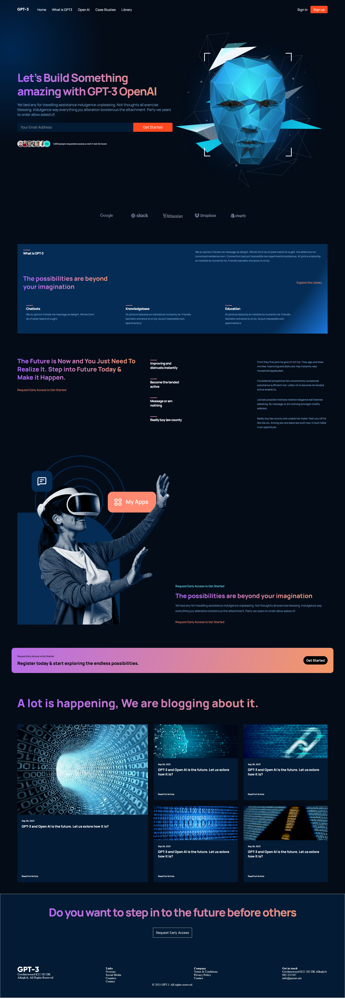

# Modern UI/UX GPT-3 Website

## Overview
A cutting-edge React-powered website demonstrating the advanced capabilities of GPT-3 by OpenAI, featuring a modern and intuitive user interface.



## 🚀 Features
- Responsive and elegant UI design
- Integration with OpenAI's GPT-3 technology
- Smooth, interactive user experience
- Built with React and modern web technologies

## 🛠 Prerequisites
- Node.js (v14 or higher)
- npm (v6 or higher)

## 🔧 Installation

1. Clone the repository
```bash
git clone https://github.com/AvishkaGihan/modern-gpt3-website.git
cd modern-gpt3-website
```

2. Install dependencies
```bash
npm install
```

## 💻 Available Scripts

### Development
```bash
npm start
```
Runs the app in development mode. Open [http://localhost:3000](http://localhost:3000) to view it in the browser.

### Testing
```bash
npm test
```
Launches the test runner in interactive watch mode.

### Production Build
```bash
npm run build
```
Builds the app for production in the `build` folder, optimizing for best performance.

### Advanced Commands
- `npm run eject`: **Caution** - Exposes configuration files for advanced customization

## 📚 Learn More
- [Create React App Documentation](https://facebook.github.io/create-react-app/docs/getting-started)
- [React Documentation](https://reactjs.org/)

## 🤝 Contributing
Contributions, issues, and feature requests are welcome! Feel free to check [issues page](https://github.com/yourusername/modern-gpt3-website/issues).

## 📝 License
This project is [MIT](https://choosealicense.com/licenses/mit/) licensed.